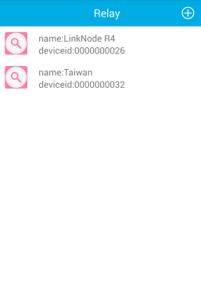
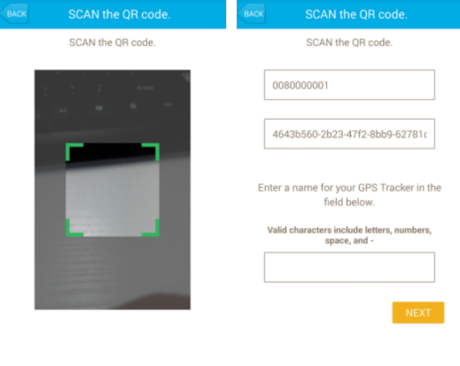
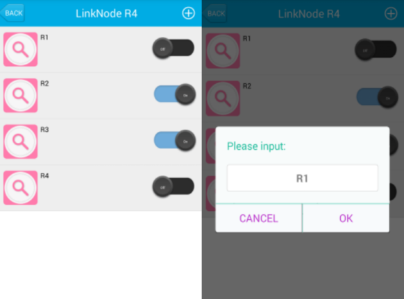

# How to use Android APP to control LinkNode R4

LinkNode R4 is an open source 4-Channel relay controller which is powered by the ESP8266 WiFi SoC.

The following will introduce how to use Android APP to control the LinkNode R4.

## Steps

#### 1. Install Android APP
* Download the APK file from the [github](https://github.com/YaoQ/LinkNodeR4-APP) and install it.

#### 2. Login LinkSpriteIO
* If you never register an account on LinkSpriteIO, please enter Email and your password, then click the **SIGN IN** button
* If you have an account on LinkSpriteIO, please enter Email and your password, then click the **REGISTER** button

#### 3. Go to Relay device list
* Click the plus icon on the upper right quarter to add a new LinkNode R4.

#### 4. Scan the QRcode
* Get the device information and register it to your account.

#### 5. Control your 4-channel relay
* control the button on the right side to turn on or off the relays, and you can click the relay's name to change it.

